# Super Car Rental — Projekt dokumentáció

<p id="doc-subtitle">Verzió: 1.0 · Készült: 2026. szeptember</p>

<p id="doc-teaminfo">
<strong>Csapatnév:</strong> ByteForge<br>
<strong>Csapattagok:</strong> Gulyás Róbert; Orosz Péter<br>
<strong>Pozíció:</strong> Szoftverfejlesztő és tesztelő
</p>

---

## Tartalomjegyzék

1. [Bevezetés](#1-bevezetés)
2. [Rendszerarchitektúra](#2-rendszerarchitektúra)
3. [Adatmodell](#3-adatmodell)
4. [Felhasználói szerepkörök](#4-felhasználói-szerepkörök)
5. [Regisztráció](#5-regisztráció)
6. [Bejelentkezés](#6-bejelentkezés)
7. [Főoldal és keresés](#7-főoldal-és-keresés)
8. [Autó adatlapja és bérlés](#8-autó-adatlapja-és-bérlés)
9. [Dashboard — bérlői nézet](#9-dashboard--bérlői-nézet)
10. [Foglalás részletei — bérlői nézet](#10-foglalás-részletei--bérlői-nézet)
11. [Dashboard — bérbeadói nézet](#11-dashboard--bérbeadói-nézet)
12. [Új autó hozzáadása és szerkesztése](#12-új-autó-hozzáadása-és-szerkesztése)
13. [Autóképek kezelése](#13-autóképek-kezelése)
14. [Foglalások kezelése bérbeadóként](#14-foglalások-kezelése-bérbeadóként)
15. [Statikus oldalak: Szolgáltatások és Kapcsolat](#15-statikus-oldalak-szolgáltatások-és-kapcsolat)
16. [API végpontok összefoglalása](#16-api-végpontok-összefoglalása)
17. [Biztonság és jogosultságkezelés](#17-biztonság-és-jogosultságkezelés)
18. [Ismert korlátok és jövőbeli fejlesztési lehetőségek](#18-ismert-korlátok-és-jövőbeli-fejlesztési-lehetőségek)
19. [Tesztelés](#19-tesztelés)
20. [Összegzés](#20-összegzés)

---

## 1. Bevezetés

A **Super Car Rental** egy kétoldalú, közvetítő jellegű autókölcsönző platform, amely két
felhasználói csoportot köt össze: azokat, akik saját autójukat szeretnék bérbe adni
(**bérbeadók**), és azokat, akik autót szeretnének bérelni (**bérlők**). A rendszer nem
hagyományos autókölcsönző — nincs saját flottája, és nem szerződő fele a bérbeadó és a bérlő
között létrejövő megállapodásnak. Kizárólag a technikai felületet biztosítja, amelyen keresztül
a hirdetések közzétehetők, kereshetők és a foglalások lebonyolíthatók.

Ez a dokumentum végigvezet a rendszer minden funkcióján mindkét szerepkör szemszögéből: a
regisztrációtól és bejelentkezéstől kezdve a keresésen és foglaláson át egészen az autók
hirdetésének és a beérkező foglalások kezelésének folyamatáig. A leírásokat a futó
alkalmazásból készített képernyőképek egészítik ki, hogy a dokumentum önmagában is jól
követhető legyen új csapattagok, ügyfelek vagy auditorok számára.

A dokumentum célközönsége elsősorban a fejlesztői csapat és a projektet megismerni kívánó
érdekelt felek (pl. termékfelelős, tesztelő, új fejlesztő). A leírt funkciók a 2026.
szeptemberi állapotot tükrözik.

---

## 2. Rendszerarchitektúra

A projekt három fő rétegre tagolódik, amelyek egy monorepóban, de egymástól függetlenül
futtatható szolgáltatásokként léteznek:

| Réteg | Technológia | Elérési út |
| --- | --- | --- |
| Frontend | React 19 + TypeScript, Vite build eszköz, Bootstrap 5 UI | `frontend/` |
| Backend | Python, FastAPI, SQLAlchemy ORM | `backend/` |
| Adatbázis | MariaDB / MySQL | `db/` (séma és seed SQL-ek) |

**Frontend.** A kliensalkalmazás egyetlen oldalas alkalmazás (SPA), amely kliensoldali
útvonalváltással (nem URL-alapú routing, hanem React state-ben tárolt „view” érték) navigál a
képernyők között. A `bootstrap` csomagot használja alap UI komponensekhez (gombok, kártyák,
rácsrendszer), a dátumválasztáshoz a `react-day-picker` könyvtárat, a stílusokhoz pedig SASS-t.
A build és fejlesztői szerver Vite-tal fut, alapértelmezett fejlesztői portja `5173`.

**Backend.** A szerveroldal egy FastAPI alkalmazás, amely négy fő routerre tagolódik:
`auth` (regisztráció, bejelentkezés, saját profil lekérdezése), `cars` (autók CRUD-ja és
keresése), `car_images` (autóképek kezelése) és `rentals` (foglalások kezelése). Az
adatbázis-hozzáférést SQLAlchemy ORM biztosítja, a bejövő/kimenő adatok validálását és
szerializálását Pydantic sémák (`schemas.py`) végzik. A backend fejlesztői szervere
alapértelmezetten a `8000`-es porton fut, és a `/docs` útvonalon interaktív (Swagger)
dokumentációt is közzétesz.

**Adatbázis.** A `db/` mappa tartalmazza a séma létrehozó (`db_schema.sql`), a kezdeti
felhasználót és jogosultságot beállító (`setup_user.sql`), valamint az opcionális teszt
adatokat betöltő (`db_data.sql`) szkripteket. Az adatbázis négy táblát tartalmaz: `users`,
`cars`, `car_images` és `rentals`.

**Feltöltött fájlok.** A bérbeadók által feltöltött autóképek a szerver helyi
fájlrendszerén, a `backend/uploads/cars/{autó_id}/` mappákban tárolódnak, és a FastAPI egy
statikus fájlkiszolgálón (`/uploads/...`) keresztül teszi őket elérhetővé a frontend számára.
Ez a megoldás egyszerű helyi fejlesztéshez és egyetlen szerveres üzemeltetéshez megfelelő;
komolyabb, több szerveres éles környezetben ezt objektumtárolóra (pl. S3-kompatibilis
szolgáltatásra) érdemes lecserélni.

A két szolgáltatás (frontend, backend) egymástól függetlenül indítható és skálázható, a
kommunikáció közöttük egyszerű, JSON-alapú REST API-n keresztül történik, CORS engedéllyel a
fejlesztői frontend origin (`http://localhost:5173`) felé.

---

## 3. Adatmodell

A rendszer négy fő entitás köré épül:

- **User** — regisztrált felhasználó, `owner` (bérbeadó) vagy `customer` (bérlő) szereppel.
  Tárolt adatai: keresztnév, vezetéknév, e-mail cím (egyedi), telefonszám, jelszó (bcrypt-tel
  hashelve), szerepkör, valamint létrehozás/módosítás időbélyeg.
- **Car** — egy bérbeadó által feltöltött jármű. Tartalmazza a márkát, modellt, évjáratot,
  váltó típusát (manuális/automata), üzemanyagtípust, fogyasztást, ülésszámot, színt, várost
  (szabad szöveges mező, nincs külön „telephely” tábla), rendszámot (egyedi), napi bérleti
  díjat, biztosítás típusát (alap/teljes körű), autópálya-matrica és klíma meglétét, valamint
  állapotát (`available` / `rented` / `maintenance`).
- **CarImage** — egy autóhoz tartozó kép. Egy autóhoz tetszőleges számú kép tartozhat, ezek
  közül pontosan egy jelölhető „elsődlegesnek” (ez jelenik meg a listákban borítóképként).
- **Rental** — egy bérlési foglalás, amely összeköt egy autót és egy bérlőt (customer_id),
  tartalmazza az átvétel és visszahozatal dátumát, a rendszer által számított végösszeget,
  valamint a foglalás állapotát (`reserved`, `ongoing`, `completed`, `cancelled`).

**Kapcsolatok.** Egy `User` (owner szerepkörrel) egy-a-többhöz kapcsolatban áll a `Car`
entitással (egy bérbeadónak több autója lehet). Egy `Car` egy-a-többhöz kapcsolatban áll a
`CarImage` entitással. Egy `Car` egy-a-többhöz kapcsolatban áll a `Rental` entitással (egy
autóra több, időben nem átfedő foglalás jöhet létre), és egy `Rental` mindig egy adott
`User`-hez (customer szerepkörrel) tartozik.

A végösszeg (`total_price`) mindig a szerveren, a foglalás létrehozásakor/módosításakor kerül
kiszámításra (`éjszakák száma × napi díj`), így a kliens oldali manipuláció nem befolyásolhatja
a fizetendő összeget.

<p align="center">
  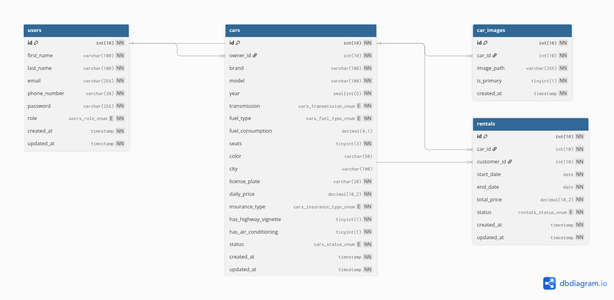
</p>

<p align="center"><em>1. ábra — Az adatbázis struktúrája (dbdiagram.io).</em></p>

---

## 4. Felhasználói szerepkörök

A regisztráció során a felhasználó eldönti, hogy **bérlőként** vagy **bérbeadóként** kívánja
használni a fiókját. A szerepkör a regisztráció után nem módosítható a felületen keresztül,
és alapjaiban meghatározza, mely funkciók érhetők el:

| Funkció | Bérlő (customer) | Bérbeadó (owner) |
| --- | --- | --- |
| Autók böngészése, keresése | ✔ | ✔ |
| Autó bérlése (foglalás létrehozása) | ✔ | ✘ |
| Saját foglalások megtekintése, módosítása, törlése | ✔ | — |
| Autó hirdetésének létrehozása, szerkesztése, törlése | ✘ | ✔ |
| Autóképek feltöltése, kezelése | ✘ | ✔ (csak saját autóhoz) |
| A saját autóira érkezett foglalások megtekintése | — | ✔ |

Fontos, hogy egy bérbeadó **nem tud** foglalást indítani — még a saját autójára sem —, mivel a
foglalás létrehozása kizárólag `customer` szerepkörhöz van kötve. Ezt a felület explicit
üzenettel is jelzi (lásd 8. fejezet).

---

## 5. Regisztráció

A regisztráció két lépésből áll. Az első lépésben a felhasználó kiválasztja, milyen céllal
szeretné használni a platformot:

<p align="center">
  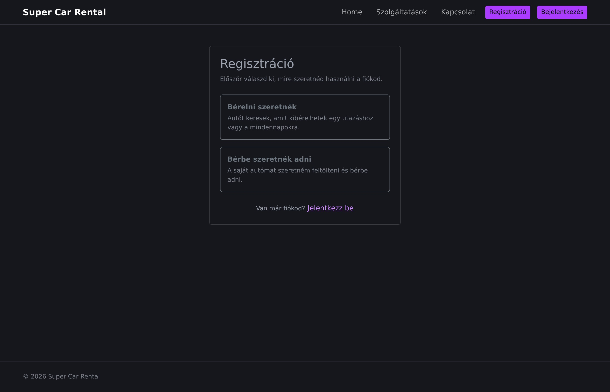
</p>

<p align="center"><em>2. ábra — Szerepkör kiválasztása: „Bérelni szeretnék” vagy „Bérbe szeretnék adni”.</em></p>

A választás után a felhasználó megadja a személyes adatait: keresztnév, vezetéknév, e-mail
cím, telefonszám, valamint a jelszót (kétszer, megerősítés céljából). A választott szerepkör a
form tetején feliratként jelenik meg, és bármikor módosítható a „Módosítom” linkre kattintva,
mielőtt a végleges regisztráció megtörténne.

<p align="center">
  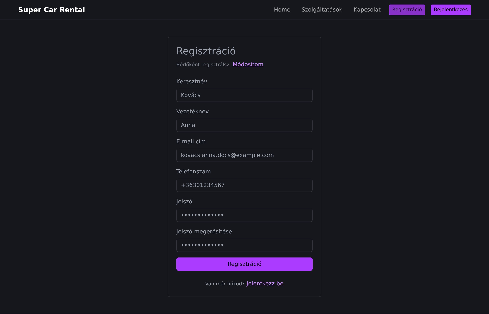
</p>

<p align="center"><em>3. ábra — A regisztrációs adatlap kitöltve, jelszó-megerősítéssel.</em></p>

**Validációs szabályok:**

- Minden mező kötelező.
- Az e-mail cím formai ellenőrzésen esik át, és egyedinek kell lennie a rendszerben — ha már
  létezik ilyen e-mail című felhasználó, a szerver `409 Conflict` hibát ad vissza.
- A jelszónak legalább 8 karakter hosszúnak kell lennie.
- A két jelszómező tartalmának egyeznie kell, ezt a kliens oldal ellenőrzi elküldés előtt.

Sikeres regisztráció után a rendszer automatikusan bejelentkezteti a felhasználót (a
regisztráció végén a kliens azonnal meghívja a bejelentkezés végpontot is az újonnan megadott
adatokkal), így külön bejelentkezési lépésre nincs szükség.

---

## 6. Bejelentkezés

A bejelentkezési felület egyszerű e-mail cím + jelszó párost kér be:

<p align="center">
  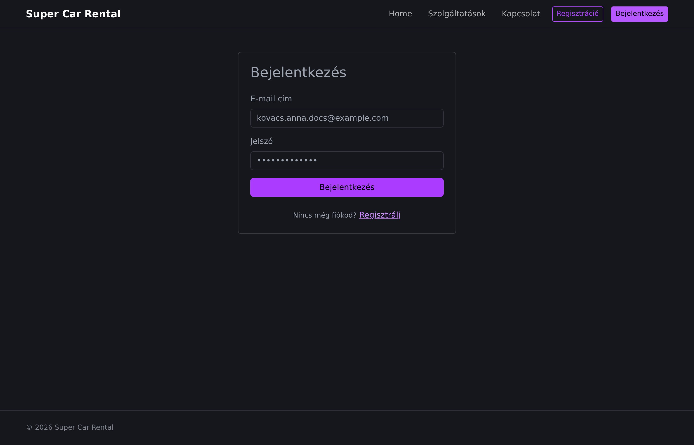
</p>

<p align="center"><em>4. ábra — Bejelentkezési űrlap.</em></p>

Sikeres bejelentkezés esetén a szerver egy JWT (JSON Web Token) hozzáférési tokent ad vissza,
amelyet a kliens a böngésző `localStorage`-ában tárol, és minden további, hitelesítést igénylő
kéréshez `Authorization: Bearer <token>` fejlécként csatol. A token érvényességi ideje
alapértelmezetten 60 perc (`ACCESS_TOKEN_EXPIRE_MINUTES` konfigurációs érték). Helytelen e-mail
cím vagy jelszó esetén a szerver `401 Unauthorized` hibát ad, amelyet a felület magyar nyelvű
hibaüzenetként jelenít meg.

Bejelentkezés után a rendszer — amennyiben a felhasználó bérlő, és van már legalább egy
foglalása — automatikusan a Dashboardra irányítja; egyébként a főoldalra kerül. Bérbeadók
bejelentkezés után mindig közvetlenül a Dashboardra jutnak.

---

## 7. Főoldal és keresés

A főoldal (be nem jelentkezett vagy bejelentkezett állapotban egyaránt) egy kereső űrlapot,
egy vízszintesen görgethető autó-válogatást, valamint egy „Miért minket válassz?” szekciót
jelenít meg:

<p align="center">
  
</p>

<p align="center"><em>5. ábra — A főoldal be nem jelentkezett látogató számára.</em></p>

A kereső űrlap három mezőt tartalmaz: **átvételi hely** (szabad szöveges városnév),
**átvétel dátuma** és **visszahozatal dátuma**. A dátumok megadása nem kötelező, de ha az egyik
dátumot megadjuk, a másikat is meg kell adni — ezt a kliens oldal ellenőrzi, és hibaüzenetet
jelenít meg, ha csak az egyik mező van kitöltve, vagy ha a visszahozatal dátuma nem később van,
mint az átvételé.

<p align="center">
  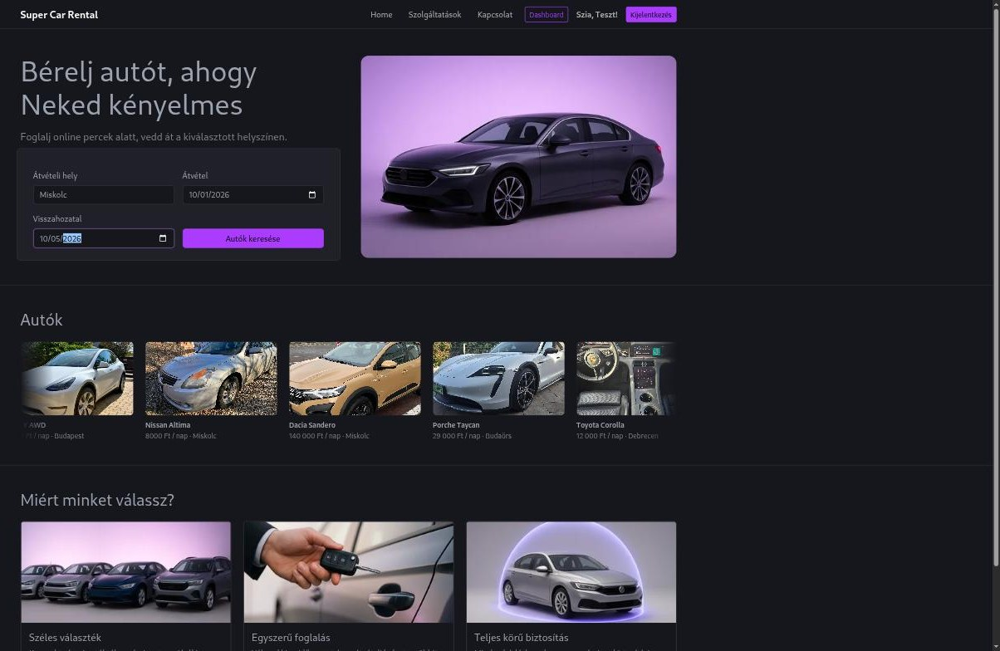
</p>

<p align="center"><em>6. ábra — Kitöltött keresés: helyszín és időszak megadva.</em></p>

A keresés elküldése után a rendszer a `/cars/search` végpontot hívja meg, amely csak az
`available` állapotú autók közül válogat, és — amennyiben dátumtartomány is meg lett adva —
kizárja azokat az autókat, amelyekre a megadott időszakban már van aktív (`reserved` vagy
`ongoing`) foglalás. Az eredmény két csoportra bomlik:

<p align="center">
  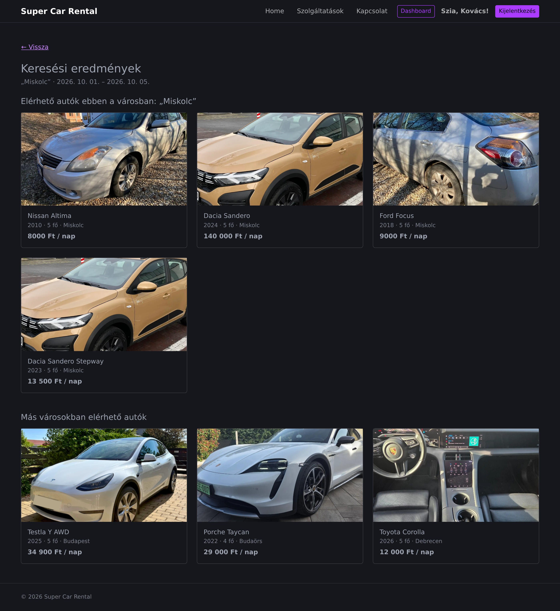
</p>

<p align="center"><em>7. ábra — Keresési eredmények: a megadott városban elérhető autók, illetve más városokban elérhető alternatívák.</em></p>

- **Elérhető autók a megadott városban** — azok az autók, amelyek városa tartalmazza a
  keresett kifejezést (kis- és nagybetű-érzéketlen, részleges egyezés is elfogadott).
- **Más városokban elérhető autók** — minden egyéb, az időszakra szabad autó, hogy a
  felhasználó akkor se maradjon üres kézzel, ha a keresett városban nincs éppen szabad jármű.

Ha a keresőmezőben nem adunk meg várost, a rendszer egyetlen, „Elérhető autók” című listában
mutatja az összes, az adott időszakra szabad autót.

---

## 8. Autó adatlapja és bérlés

Egy autóra kattintva (akár a főoldali válogatásból, akár a keresési találatok közül) megnyílik
az autó részletes adatlapja. Ez tartalmazza a képgalériát (kattintásra nagyítható,
nyilakkal/görgővel/billentyűzettel lapozható lightbox nézettel), a műszaki adatokat, az árat,
valamint — bérlőként bejelentkezve — egy foglalási naptárt:

<p align="center">
  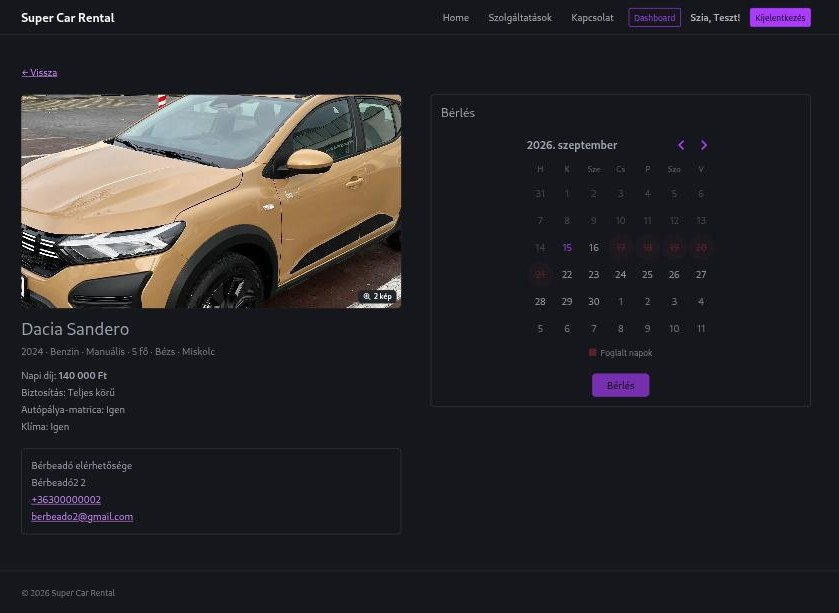
</p>

<p align="center"><em>8. ábra — Autó adatlapja bérlő nézetben, a foglalási naptárral. A pirossal jelölt napok már foglaltak.</em></p>

A naptár a `/cars/{id}/availability` végpontról lekért, már lefoglalt időszakokat pirossal
jelöli, és ezekre a napokra (valamint a mai nap előttre) nem enged dátumot választani. A
felhasználó egy dátumtartományt jelöl ki (átvétel–visszahozatal), amire a rendszer azonnal
kiszámolja és megjeleníti a bérlés végösszegét:

<p align="center">
  
</p>

<p align="center"><em>9. ábra — Kiválasztott időszak és az automatikusan számított végösszeg (napok száma × napi díj).</em></p>

A „Bérlés” gombra kattintva a kliens elküldi a foglalást a `/rentals` végpontnak, amely
szerver oldalon újra ellenőrzi az ütközésmentességet (nehogy két bérlő versenyhelyzetben
ugyanarra az időszakra foglaljon le egy autót), majd létrehozza a foglalást és kiszámítja a
végösszeget. Sikeres foglalás esetén megerősítő üzenet jelenik meg:

<p align="center">
  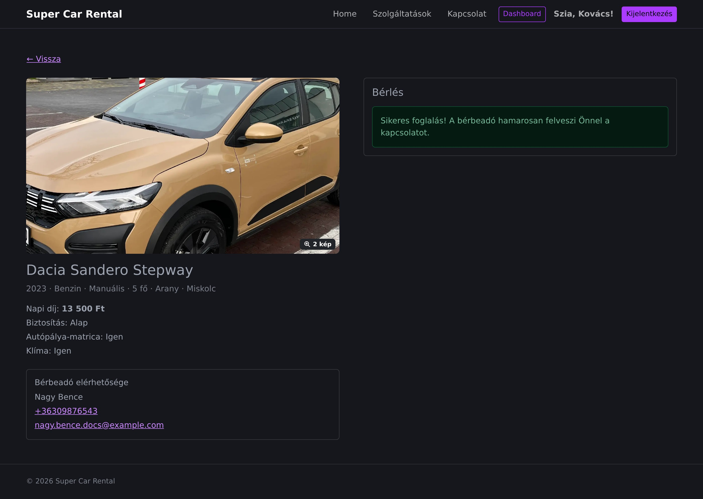
</p>

<p align="center"><em>10. ábra — Sikeres foglalás visszajelzése.</em></p>

**Speciális esetek a bérlési panelen:**

- Ha a látogató nincs bejelentkezve, a panel felkéri a bejelentkezésre („A bérléshez be kell
  jelentkezned”), és egy gombbal a bejelentkezési oldalra navigál.
- Ha a bejelentkezett felhasználó bérbeadó szerepkörű, a rendszer tájékoztatja, hogy
  bérbeadóként nem foglalhat autót — ez a szabály minden autóra vonatkozik, a bérbeadó saját
  autóit sem tudja „kipróbálásképpen” lefoglalni.
- Ha a bejelentkezett felhasználó éppen a saját autójának adatlapját nézi (bérbeadóként), a
  bérlési panel helyett az adott autóra vonatkozó, addig beérkezett foglalások listája jelenik
  meg (lásd 14. fejezet).

Minden autó adatlapján megjelenik a **bérbeadó elérhetősége** (név, telefonszám, e-mail cím)
is, hiszen a platform marketplace jellegéből adódóan a bérlőnek közvetlenül a bérbeadóval kell
egyeztetnie az átvétel részleteiről.

---

## 9. Dashboard — bérlői nézet

Bejelentkezés után a bérlő a navigációs sáv „Dashboard” gombjával éri el a saját
áttekintő felületét, amely a saját foglalásainak listáját mutatja:

<p align="center">
  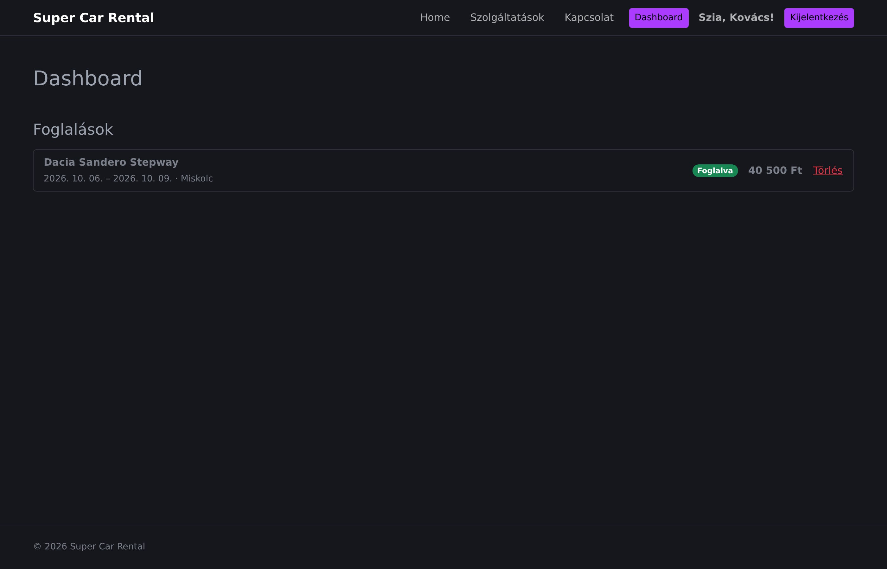
</p>

<p align="center"><em>11. ábra — Bérlői Dashboard: a saját foglalások listája, státusszal és összeggel.</em></p>

Minden foglalási sor megjeleníti az autó márkáját/modelljét, az időszakot, a várost, a
foglalás állapotát (színes jelvénnyel: *Foglalva*, *Folyamatban*, *Lezárva*, *Lemondva*), a
végösszeget, valamint egy közvetlen törlés lehetőséget. A listára kattintva megnyílik a
foglalás részletező oldala.

---

## 10. Foglalás részletei — bérlői nézet

A foglalás részletező oldala megmutatja az autó adatait, a foglalás pontos adatait (átvétel,
visszahozatal, időtartam éjszakában, végösszeg, létrehozás dátuma), valamint — mivel itt a
bérlő a néző — **a bérbeadó elérhetőségét**, hogy a bérlő fel tudja venni vele a kapcsolatot az
átvétel egyeztetéséhez:

<p align="center">
  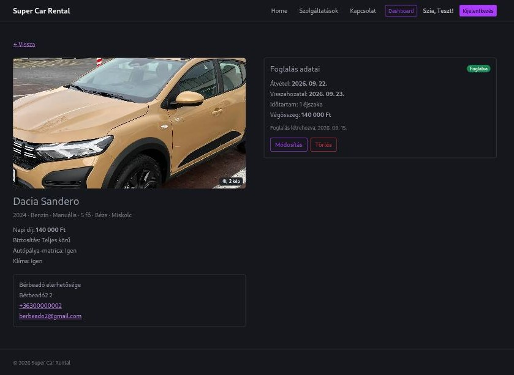
</p>

<p align="center"><em>12. ábra — Foglalás részletei bérlő nézetben: a bérbeadó neve, telefonszáma és e-mail címe jelenik meg.</em></p>

Amíg a foglalás `reserved` (foglalva) állapotban van, a bérlő két műveletet végezhet:

- **Módosítás** — az időszak megváltoztatása egy beágyazott naptár segítségével, amely
  ugyanúgy figyelembe veszi a már lefoglalt napokat (a szerkesztett foglalás saját napjait
  természetesen nem tekinti ütközésnek). Mentéskor a végösszeg is újraszámolódik.
- **Törlés** — a foglalás lemondása megerősítő kérdés után.

Fontos jogosultsági szabály, hogy egy foglalást a bérlő (aki foglalta) *és* az érintett autó
bérbeadója is törölhet — ezzel mindkét fél lemondhatja a megállapodást, ha szükséges.

> **Megjegyzés a bérbeadó/bérlő adatok megjelenítéséről.** A rendszer úgy lett kialakítva,
> hogy a foglalás részletező oldalán mindig a *másik fél* elérhetősége jelenjen meg: bérlőként
> nézve a bérbeadóét (ezt mutatja a 12. ábra), bérbeadóként nézve pedig a bérlőét (lásd a 18.
> ábrát a 14. fejezetben). Ez korábban nem volt így — a nézet régebbi verziójában mindig a
> bérbeadó adatai jelentek meg, függetlenül attól, ki nyitotta meg az oldalt, ami bérbeadói
> nézetben értelmetlen volt (a bérbeadó a saját adatait látta viszont). A jelenlegi
> viselkedés szerepkör-függő, és mindkét oldal számára hasznos információt ad.

---

## 11. Dashboard — bérbeadói nézet

Bérbeadóként bejelentkezve a Dashboard két szekcióra bővül: a saját autóira érkezett
**Foglalások**, valamint a **Kocsijaim** (saját hirdetések) listája:

<p align="center">
  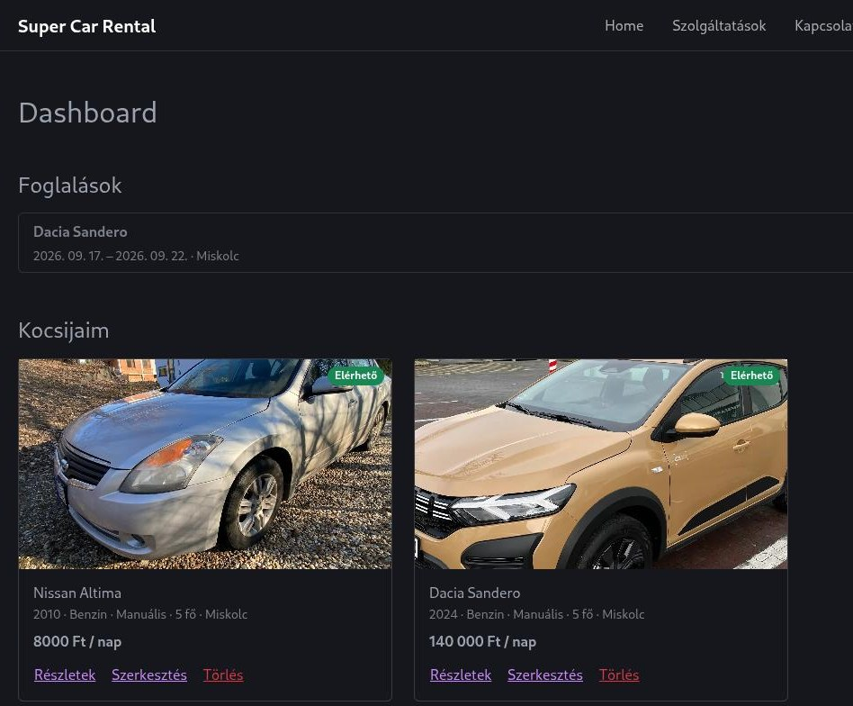
</p>

<p align="center"><em>13. ábra — Bérbeadói Dashboard: a beérkezett foglalások és a saját autók áttekintése.</em></p>

A „Kocsijaim” szekció minden autóhoz megjeleníti a borítóképet, az állapotjelvényt
(*Elérhető*, *Bérelve*, *Karbantartás alatt*), az alapadatokat és a napi díjat, valamint három
műveletet: **Részletek** (a nyilvános adatlap megnyitása), **Szerkesztés** (adatok és képek
módosítása) és **Törlés**.

---

## 12. Új autó hozzáadása és szerkesztése

A „+ Új kocsi hozzáadása” gombra kattintva egy modális ablakban nyílik meg az autó adatlapja
kitöltő űrlap:

<p align="center">
  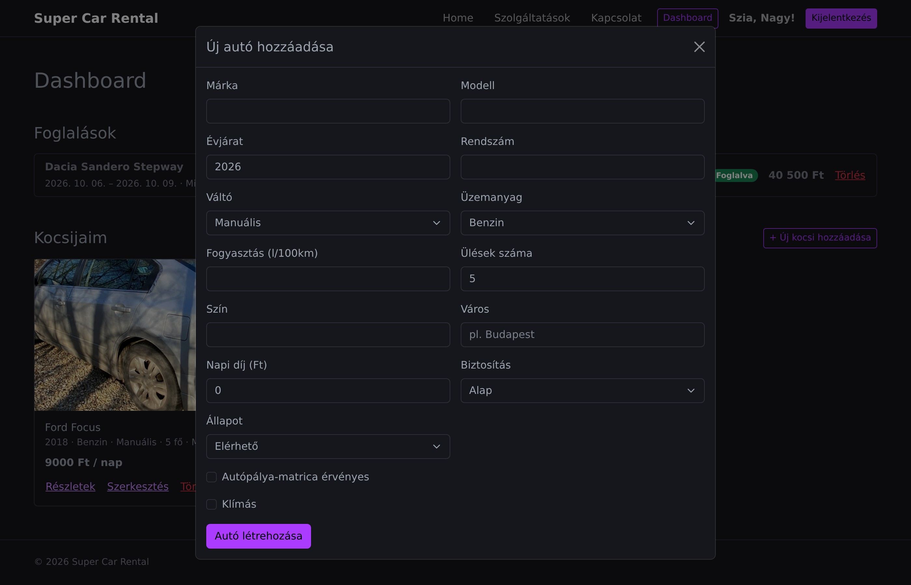
</p>

<p align="center"><em>14. ábra — Az „Új autó hozzáadása” űrlap, kitöltés előtt.</em></p>

A form a következő mezőket kéri: márka, modell, évjárat, rendszám, váltó típusa (manuális /
automata), üzemanyagtípus (benzin / dízel / elektromos / hibrid / LPG), fogyasztás
(l/100 km, opcionális), ülésszám, szín (opcionális), város (opcionális, szabad szöveg), napi
díj, biztosítás típusa (alap / teljes körű), állapot (elérhető / bérelve / karbantartás alatt),
valamint két jelölőnégyzet: van-e érvényes autópálya-matricája, illetve klímás-e a jármű.

<p align="center">
  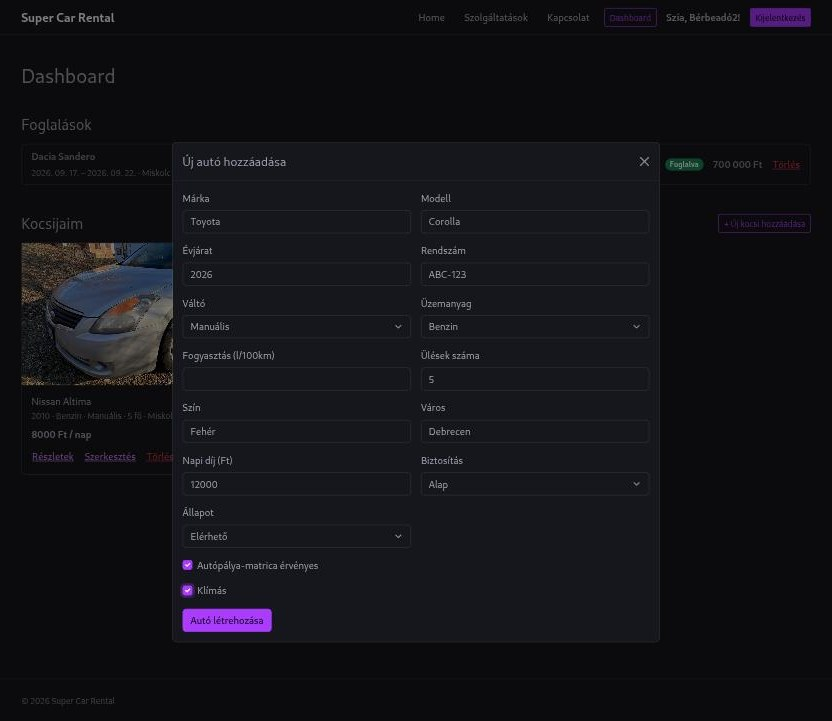
</p>

<p align="center"><em>15. ábra — Kitöltött űrlap, mentés előtt.</em></p>

**Validáció:** a márka, modell, évjárat, rendszám, ülésszám és napi díj kötelező mezők. A
rendszámnak egyedinek kell lennie a teljes rendszerben — ha már létezik ugyanezzel a rendszámmal
regisztrált autó, a szerver `409 Conflict` hibát ad vissza, amit a felület hibaüzenetként
jelenít meg.

Az „Autó létrehozása” gomb megnyomása után az autó azonnal létrejön, és az ablak automatikusan
átvált „Autó szerkesztése” módba, ahol egyből elérhetővé válik a képfeltöltési szekció is (lásd
következő fejezet) — így egyetlen folyamatban, megszakítás nélkül végigvihető az új hirdetés
teljes összeállítása.

Meglévő autó „Szerkesztés” gombjára kattintva ugyanez a form nyílik meg, előre kitöltve az
autó jelenlegi adataival; a „Módosítások mentése” gomb a `PUT /cars/{id}` végpontot hívja, és
csak a bérbeadó saját autóin engedélyezett.

---

## 13. Autóképek kezelése

Az autó szerkesztő ablak alsó részén, „Képek” cím alatt kezelhetők az autóhoz tartozó fényképek:

<p align="center">
  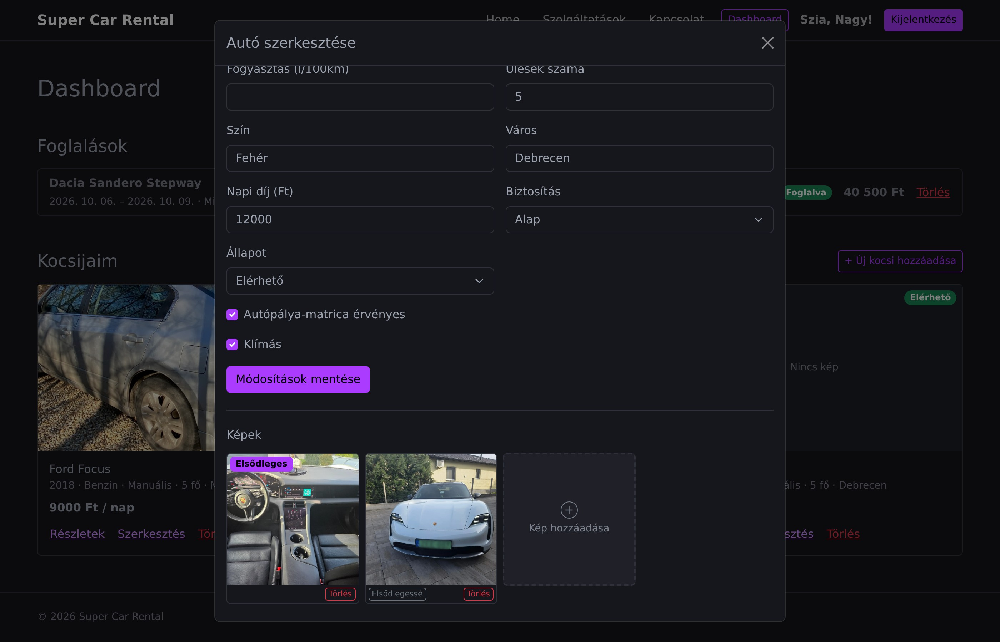
</p>

<p align="center"><em>16. ábra — Két feltöltött kép: az első automatikusan elsődlegesként lett megjelölve.</em></p>

Egy kép feltöltéséhez elég a „Kép hozzáadása” csempére kattintva fájlt választani; a rendszer
JPEG, PNG, WebP és GIF formátumokat fogad el, alapértelmezetten legfeljebb 5 MB méretig. Az
első feltöltött kép automatikusan **elsődlegessé** válik — ez jelenik meg borítóképként a
listákban és a keresési találatokban —, de bármelyik további kép egy kattintással
„Elsődlegessé” tehető. Egy kép törlése a hozzá tartozó fájlt is eltávolítja a szerver
lemezéről, nem csak az adatbázis-bejegyzést.

---

## 14. Foglalások kezelése bérbeadóként

Egy adott autó nyilvános adatlapját a tulajdonos bérbeadó megnyitva nem a bérlési panelt látja,
hanem az arra az autóra addig beérkezett foglalások listáját, dátummal, státusszal és
összeggel:

<p align="center">
  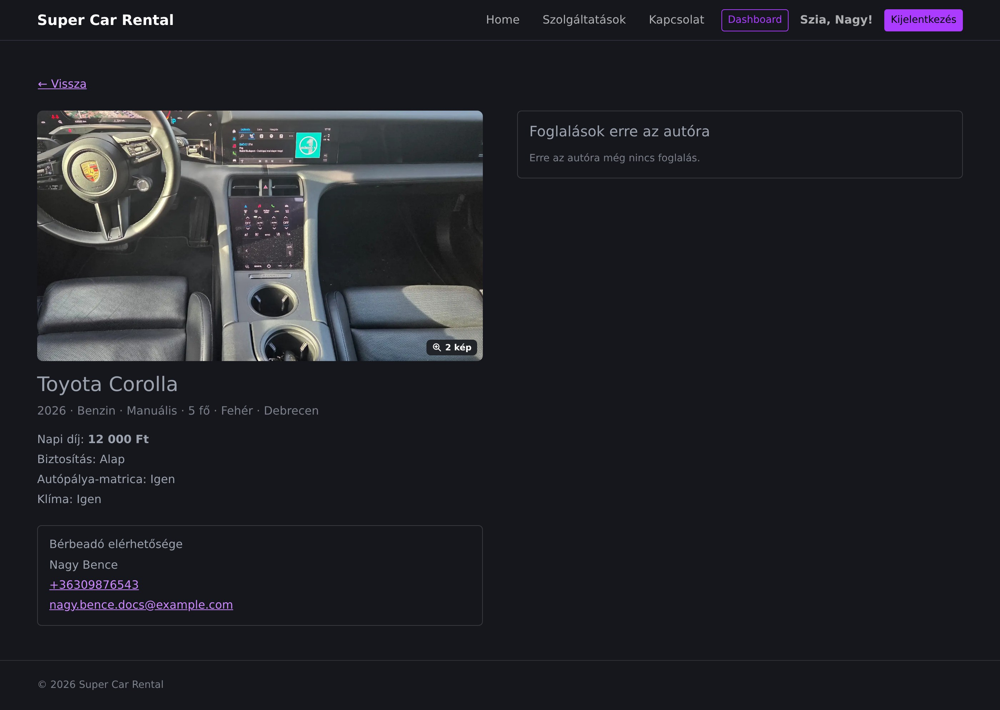
</p>

<p align="center"><em>17. ábra — Az autó saját adatlapja bérbeadói nézetben: a jobb oldali panelen az adott autóra érkezett foglalások listája (jelen esetben még nincs egy sem az újonnan felvitt autóhoz).</em></p>

A listában egy foglalásra kattintva a bérbeadó is eljut a foglalás részletező oldalára —
ugyanarra a képernyőre, amit a bérlő is lát —, de ahogy a 10. fejezetben már jeleztük, itt a
**bérlő elérhetősége** jelenik meg a bérbeadó adatai helyett, hiszen a bérbeadónak arra van
szüksége, hogy fel tudja venni a kapcsolatot azzal, aki lefoglalta az autóját:

<p align="center">
  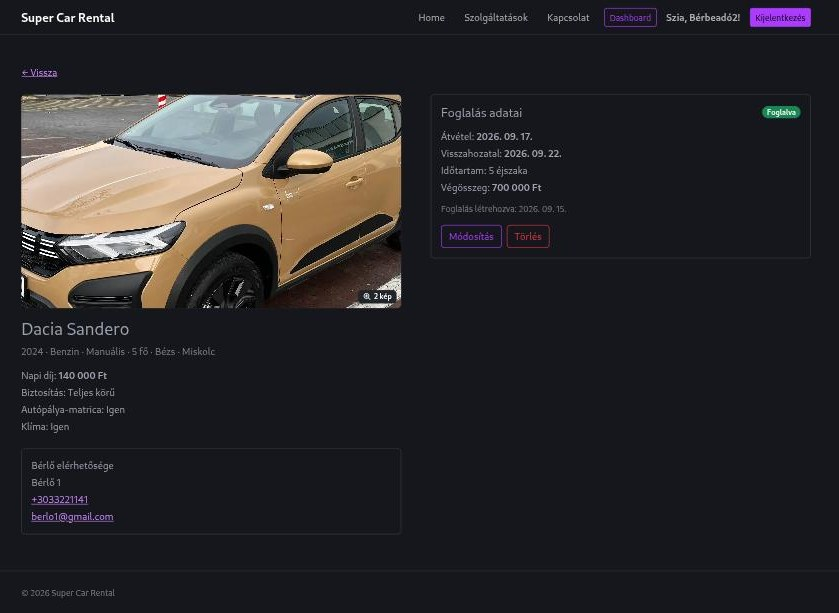
</p>

<p align="center"><em>18. ábra — Foglalás részletei bérbeadó nézetben: a bérlő neve, telefonszáma és e-mail címe jelenik meg a „Bérbeadó elérhetősége” kártya helyén.</em></p>

A bérbeadó ugyanúgy tud a foglaláson **Módosítást** (időszak megváltoztatása) és **Törlést**
végezni, mint a bérlő — ez lehetővé teszi, hogy szükség esetén a bérbeadó is lemondja a
foglalást (pl. ha az autó időközben meghibásodott).

Ha egy autóra még egyáltalán nem érkezett foglalás, a panel ezt egyszerű szöveggel jelzi
(„Erre az autóra még nincs foglalás.”), ahogy azt a 17. ábra is mutatja egy frissen felvitt
autó esetében.

---

## 15. Statikus oldalak: Szolgáltatások és Kapcsolat

A navigációs sáv két, bejelentkezés nélkül is elérhető statikus oldalra mutat.

**Szolgáltatások.** Ez az oldal írja le szövegesen a platform jogi jellegét: hogy a Super Car
Rental közvetítő platform, nem szerződő fél a bérbeadó és a bérlő között, és nem vállal
felelősséget a hirdetések valóságtartalmáért vagy a felek közti megállapodás teljesítéséért.
Az oldal alján ugyanaz a „Miért minket válassz?” kártyasor jelenik meg, mint a főoldalon.

<p align="center">
  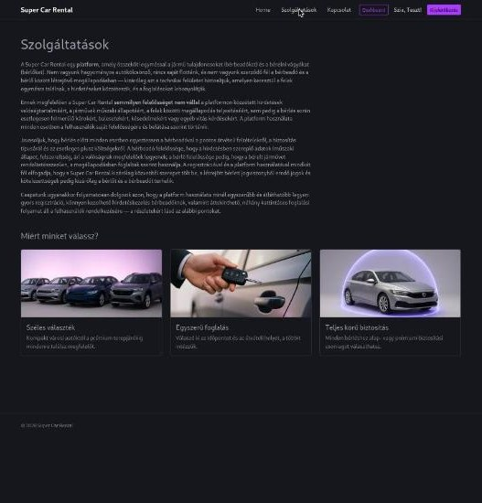
</p>

<p align="center"><em>19. ábra — A Szolgáltatások oldal.</em></p>

**Kapcsolat.** Elérhetőségi adatokat (cím, e-mail), egy beágyazott Google térképet a
telephely elhelyezkedéséről, valamint egy egyszerű kapcsolatfelvételi űrlapot (név, e-mail,
üzenet) tartalmaz. Az űrlap jelenleg kliensoldali visszajelzést ad elküldés után
(„Köszönjük az üzenetet!”), szerver oldali feldolgozás nélkül — ez elsősorban a felület
bemutatására szolgáló elem.

<p align="center">
  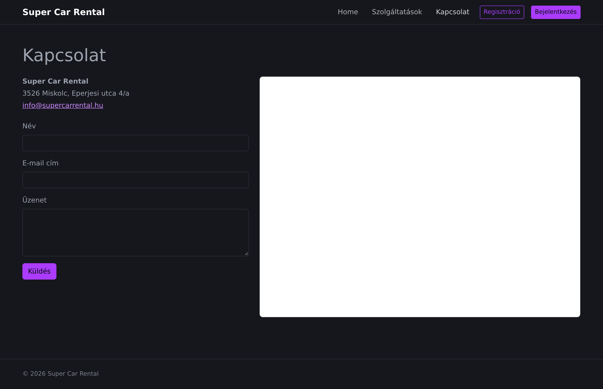
</p>

<p align="center"><em>20. ábra — A Kapcsolat oldal, beágyazott térképpel.</em></p>

---

## 16. API végpontok összefoglalása

A backend a következő REST végpontokat teszi elérhetővé (a teljes, interaktív dokumentáció a
futó szerveren a `/docs` útvonalon érhető el):

| Metódus | Végpont | Leírás | Jogosultság |
| --- | --- | --- | --- |
| GET | `/health` | Egyszerű állapotellenőrzés | Publikus |
| POST | `/auth/register` | Új felhasználó regisztrálása | Publikus |
| POST | `/auth/login` | Bejelentkezés, JWT token kiadása | Publikus |
| GET | `/auth/me` | A bejelentkezett felhasználó adatai | Bejelentkezett |
| GET | `/cars` | Az összes autó listázása | Publikus |
| GET | `/cars/search` | Keresés város és/vagy időszak szerint | Publikus |
| GET | `/cars/mine` | A saját autók listázása | Bérbeadó |
| GET | `/cars/{id}` | Egy autó adatai | Publikus |
| GET | `/cars/{id}/availability` | Egy autó lefoglalt időszakai | Publikus |
| POST | `/cars` | Új autó létrehozása | Bérbeadó |
| PUT | `/cars/{id}` | Autó adatainak módosítása | Bérbeadó (saját autó) |
| DELETE | `/cars/{id}` | Autó törlése | Bérbeadó (saját autó) |
| GET | `/cars/{id}/images` | Egy autó képeinek listája | Publikus |
| POST | `/cars/{id}/images/upload` | Kép feltöltése fájlként | Bérbeadó (saját autó) |
| PUT | `/cars/{id}/images/{image_id}` | Kép metaadatainak módosítása | Bérbeadó (saját autó) |
| DELETE | `/cars/{id}/images/{image_id}` | Kép törlése | Bérbeadó (saját autó) |
| GET | `/rentals` | Foglalások listázása (szerepkör szerint szűrve) | Bejelentkezett |
| POST | `/rentals` | Új foglalás létrehozása | Bérlő |
| PATCH | `/rentals/{id}` | Foglalás időszakának módosítása | Érintett bérlő vagy bérbeadó |
| DELETE | `/rentals/{id}` | Foglalás törlése | Érintett bérlő vagy bérbeadó |

A `GET /rentals` végpont viselkedése szerepkörtől függ: bérbeadó a saját autóira vonatkozó
összes foglalást látja, bérlő pedig a saját, általa létrehozott foglalásait.

---

## 17. Biztonság és jogosultságkezelés

**Jelszókezelés.** A felhasználói jelszavak soha nem tárolódnak, és nem is kerülnek naplózásra
nyílt szövegként — regisztrációkor a rendszer `bcrypt` algoritmussal hasheli őket, és csak a
hash kerül az adatbázisba. Bejelentkezéskor a megadott jelszó hash-ét hasonlítja össze a
tárolttal.

**Hitelesítés.** A rendszer OAuth2 „password” séma szerinti JWT-alapú hitelesítést használ. A
bejelentkezéskor kapott token a felhasználó azonosítóját (`sub` mező) tartalmazza, HS256
algoritmussal aláírva, egy környezeti változóban tárolt titkos kulccsal (`JWT_SECRET_KEY`). A
token élettartama konfigurálható (`ACCESS_TOKEN_EXPIRE_MINUTES`, alapértelmezetten 60 perc).

**Jogosultságellenőrzés.** Minden, módosítást végző végpont szerepkör- és/vagy
tulajdonos-ellenőrzésen esik át a szerver oldalon (nem csupán a felületen van elrejtve a
funkció):

- Autó létrehozása, módosítása és törlése kizárólag `owner` szerepkörű, bejelentkezett
  felhasználóknak engedélyezett, és módosítás/törlés esetén a szerver azt is ellenőrzi, hogy a
  kérést küldő felhasználó valóban az adott autó tulajdonosa-e.
- Foglalás létrehozása kizárólag `customer` szerepkörű felhasználóknak engedélyezett.
- Egy foglalás módosítására vagy törlésére a foglalást létrehozó bérlő, illetve az érintett
  autó bérbeadója jogosult — más felhasználó `403 Forbidden` választ kap.
- Az autóképek feltöltése, módosítása és törlése az adott autó tulajdonosára korlátozott.

**CORS.** A backend jelenleg kizárólag a fejlesztői frontend origint (`http://localhost:5173`)
engedélyezi CORS szinten — éles környezetbe történő telepítéskor ezt a tényleges frontend
domainre kell módosítani.

**Feltöltött fájlok ellenőrzése.** A képfeltöltés végpont ellenőrzi a fájl MIME típusát
(csak képformátumok engedélyezettek) és méretét (`MAX_UPLOAD_SIZE_MB`), mielőtt a fájlt a
lemezre menti, egyedi, véletlenszerűen generált fájlnévvel — így a feltöltött fájlnév nem
befolyásolható a kliens által, és nem írhat felül meglévő fájlt.

---

## 18. Ismert korlátok és jövőbeli fejlesztési lehetőségek

A dokumentáció készítésekor feltárt, illetve a kódból egyértelműen következő korlátok és
lehetséges továbbfejlesztési irányok:

- **Fizetés nincs a rendszerben.** A foglalás pusztán egy szándéknyilatkozat és
  időpontfoglalás; a tényleges fizetés és az autó fizikai átadása a feleken (bérlő és
  bérbeadó) múlik, a platformon kívül.
- **Nincs értékelési/review rendszer** sem az autókra, sem a felhasználókra vonatkozóan, ami
  segítené a bizalom kiépítését a marketplace-en.
- **Nincs e-mail vagy push értesítés** (pl. új foglalás érkezésekor, közelgő átvétel előtt),
  jelenleg minden információ a felületen belül, aktív bejelentkezés mellett érhető el.
- **A képtárolás helyi lemezen történik**, ami egyetlen szerveres üzemeltetésnél megfelelő, de
  több szerver esetén (horizontális skálázás) megosztott tárolóra (pl. objektumtárolóra) kell
  váltani.
- **A Kapcsolat oldal űrlapja nem küld valódi üzenetet**, csak kliensoldali visszajelzést ad —
  ez éles használat előtt backend-integrációt igényel (pl. e-mail küldés vagy jegyrendszerbe
  történő rögzítés).
- **A szerepkör regisztráció után nem módosítható** a felületen; ha egy felhasználó mindkét
  szerepkört szeretné használni, jelenleg két külön fiókra van szüksége.
- **Nincs jelszó-visszaállítási folyamat** (elfelejtett jelszó esetére).

---

## 19. Tesztelés

A leszállítás előtt manuális funkcionális tesztelést végeztünk a fő felhasználói folyamatokon,
mindkét szerepkörben (bérlő és bérbeadó), helyi fejlesztői környezetben.

**Tesztkörnyezet:**

| Paraméter | Érték |
| --- | --- |
| Dátum | 2026. 09. 16. |
| Backend | `http://127.0.0.1:8000` (FastAPI, uvicorn, `--reload`) |
| Frontend | `http://localhost:5173` (Vite dev szerver) |
| Adatbázis | MariaDB 11.8, `supercarrental` séma, seed adatokkal feltöltve |
| Böngésző | Chrome (asztali, 1560×784 nézetablak) |
| Tesztelők | Gulyás Róbert, Orosz Péter (ByteForge csapat) |

### 19.1 Tesztesetek

| ID | Teszteset | Lépések | Elvárt eredmény | Eredmény |
| --- | --- | --- | --- | --- |
| TC-01 | Sikeres regisztráció bérlőként | Regisztrációs űrlap kitöltése, „Bérelni szeretnék” szerepkörrel | Fiók létrejön, automatikus bejelentkezés | Sikeres |
| TC-02 | Regisztráció már foglalt e-mail címmel | Regisztráció egy már létező e-mail címmel | `409 Conflict`, hibaüzenet a felületen | Sikeres |
| TC-03 | Sikeres bejelentkezés | Helyes e-mail + jelszó megadása | `200 OK`, JWT token kiadva, átirányítás | Sikeres |
| TC-04 | Bejelentkezés hibás jelszóval | Helyes e-mail, hibás jelszó | `401 Unauthorized`, „Invalid email or password” üzenet | Sikeres |
| TC-05 | Keresés város és időszak szerint | Keresés „Miskolc” + 2026.10.01–10.05 időszakra | Találati lista két csoportban (helyi / más városi) | Sikeres |
| TC-06 | Keresés csak egyik dátum megadásával | Csak az átvétel dátumának kitöltése | Kliensoldali validációs hibaüzenet, keresés nem indul | Sikeres |
| TC-07 | Sikeres foglalás létrehozása bérlőként | Dacia Sandero kiválasztása, 2026.09.22–23, „Bérlés” gomb | `201 Created`, foglalás megjelenik a Dashboardon | Sikeres |
| TC-08 | Bérbeadó megpróbál foglalni | Bérbeadó fiókkal autó adatlapjának megnyitása | Bérlési panel helyett tájékoztató üzenet, nincs foglalás gomb | Sikeres |
| TC-09 | Ütköző időszakra foglalás | Már lefoglalt napokra próbált foglalás | `409 Conflict`, „Az autó már foglalt a megadott időszakra” | Sikeres |
| TC-10 | Foglalás módosítása | „Módosítás” gomb, új dátumtartomány, „Mentés” | Foglalás frissül, végösszeg újraszámolva | Sikeres |
| TC-11 | Foglalás törlése bérlő által | „Törlés” gomb a foglalás részletező oldalán, megerősítés | Foglalás eltűnik a listából, `204 No Content` | Sikeres |
| TC-12 | Új autó létrehozása bérbeadóként | „+ Új kocsi hozzáadása”, adatok kitöltése, mentés | `201 Created`, autó megjelenik a „Kocsijaim” listában | Sikeres |
| TC-13 | Autó létrehozása foglalt rendszámmal | Már létező rendszám megadása | `409 Conflict`, „License plate already registered” | Sikeres |
| TC-14 | Autókép feltöltése és elsődleges váltás | Két kép feltöltése, majd a második „Elsődlegessé” tétele | Első kép automatikusan elsődleges, váltás után a második lesz az | Sikeres |
| TC-15 | Idegen autó szerkesztésének megkísérlése | Másik bérbeadó autójának `PUT` kérése saját tokennel | `403 Forbidden`, „Not the owner of this car” | Sikeres |
| TC-16 | Szerepkör-függő elérhetőség a foglalás adatlapján | Ugyanazon foglalás megnyitása bérlőként, majd bérbeadóként | Bérlőként a bérbeadó, bérbeadóként a bérlő elérhetősége jelenik meg | Sikeres (javítás után) |

> **Megjegyzés TC-16-hoz.** Ez a teszteset eredetileg hibát talált: a foglalás részletező
> oldal minden nézetben a bérbeadó adatait mutatta, bérbeadóként ez értelmetlen volt (saját
> magát látta viszont). A hibát a backend (`RentalOut` séma, `customer` mező hozzáadása) és a
> frontend (`RentalDetailPage` szerepkör-függő logika) módosításával javítottuk, ezt követően a
> teszteset megismétlésre került, és sikeresen lezárult — lásd a 10. és 14. fejezetet.

### 19.2 Napló részlet (kivonat)

Az alábbi kivonat a manuális tesztelés során, a böngésző fejlesztői eszközeivel és a backend
konzoljával megfigyelt kérés/válasz eseményeket foglalja össze, időbélyeggel:

```
[2026-09-16 10:12:03] TC-01 POST /auth/register email=teszt.elek.docs@example.com role=customer -> 201 Created
[2026-09-16 10:12:04] TC-01 POST /auth/login   email=teszt.elek.docs@example.com -> 200 OK (token kiadva)
[2026-09-16 10:13:20] TC-02 POST /auth/register email=teszt.elek.docs@example.com role=customer -> 409 Conflict "Email already registered"
[2026-09-16 10:13:55] TC-04 POST /auth/login   email=teszt.elek.docs@example.com password=rossz -> 401 Unauthorized
[2026-09-16 10:14:11] TC-05 GET  /cars/search?city=Miskolc&start_date=2026-10-01&end_date=2026-10-05 -> 200 OK (matching=2, other=3)
[2026-09-16 10:16:47] TC-07 POST /rentals car_id=4 start_date=2026-09-22 end_date=2026-09-23 -> 201 Created total_price=140000
[2026-09-16 10:17:30] TC-08 GET  /cars/4 (bérbeadó munkamenet) -> bérlési panel nem jelenik meg (canBook=false)
[2026-09-16 10:19:02] TC-09 POST /rentals car_id=4 start_date=2026-09-22 end_date=2026-09-24 -> 409 Conflict "Az autó már foglalt a megadott időszakra"
[2026-09-16 10:21:14] TC-10 PATCH /rentals/7 start_date=2026-09-23 end_date=2026-09-24 -> 200 OK total_price=140000
[2026-09-16 10:22:40] TC-11 DELETE /rentals/7 -> 204 No Content
[2026-09-16 10:25:03] TC-12 POST /cars brand=Toyota model=Corolla license_plate=ABC-123 -> 201 Created id=15
[2026-09-16 10:25:44] TC-13 POST /cars license_plate=ABC-123 (duplikált) -> 409 Conflict "License plate already registered"
[2026-09-16 10:26:58] TC-14 POST /cars/15/images/upload file=demo-car-1.webp is_primary=true -> 201 Created is_primary=true
[2026-09-16 10:27:12] TC-14 POST /cars/15/images/upload file=demo-car-2.webp is_primary=false -> 201 Created is_primary=false
[2026-09-16 10:29:37] TC-15 PUT  /cars/9 (idegen autó) -> 403 Forbidden "Not the owner of this car"
[2026-09-16 11:02:18] TC-16 GET  /rentals/3 (bérlőként megnyitva) -> "Bérbeadó elérhetősége" kártya jelenik meg — MEGFELEL
[2026-09-16 11:03:05] TC-16 GET  /rentals/3 (bérbeadóként megnyitva, javítás ELŐTT) -> "Bérbeadó elérhetősége" kártya jelenik meg — NEM MEGFELEL
[2026-09-16 14:41:52] TC-16 GET  /rentals/3 (bérbeadóként megnyitva, javítás UTÁN) -> "Bérlő elérhetősége" kártya jelenik meg — MEGFELEL
```

### 19.3 Összefoglaló

A 16 tesztesetből mind a 16 sikeresen lezárult; a TC-16 során talált hibát a csapat még a
leszállítás előtt kijavította és újratesztelte. Automatizált (unit/integrációs) tesztek
jelenleg nincsenek a projektben — ez a 18. fejezetben felsorolt továbbfejlesztési pontok közé
tartozik.

---

## 20. Összegzés

A Super Car Rental platform egy letisztult, kétoldalú piactér modellt valósít meg: a bérbeadók
egyszerűen és gyorsan tudják feltölteni és kezelni hirdetéseiket (autó adatok, több kép,
elsődleges kép kijelölése, állapotkövetés), a bérlők pedig könnyen kereshetnek helyszín és
időszak szerint, foglalhatnak néhány kattintással, és mindkét oldal átlátható módon éri el a
másik fél elérhetőségét a foglalás létrejötte után.

A rendszer architektúrája (különálló frontend/backend, JSON REST API, JWT hitelesítés,
szerepkör-alapú jogosultságkezelés) jól illeszkedik egy kisebb-közepes méretű, egy szerveren
futtatható alkalmazás igényeihez, és a 18. fejezetben felsorolt pontok mentén viszonylag
egyszerűen bővíthető egy teljes körű, éles használatra kész platformmá.

---

*Ez a dokumentum a `docs/PROJEKT_DOKUMENTACIO.md` fájlban él a projekt gyökerében, a hozzá
tartozó képernyőképek a `docs/images/` mappában találhatók. A dokumentum Markdown formátumban
készült, hogy egyszerűen konvertálható legyen A4 méretű PDF-fé (pl. `pandoc` vagy hasonló
eszköz segítségével), a repóban pedig közvetlenül is olvasható és karbantartható marad.*
